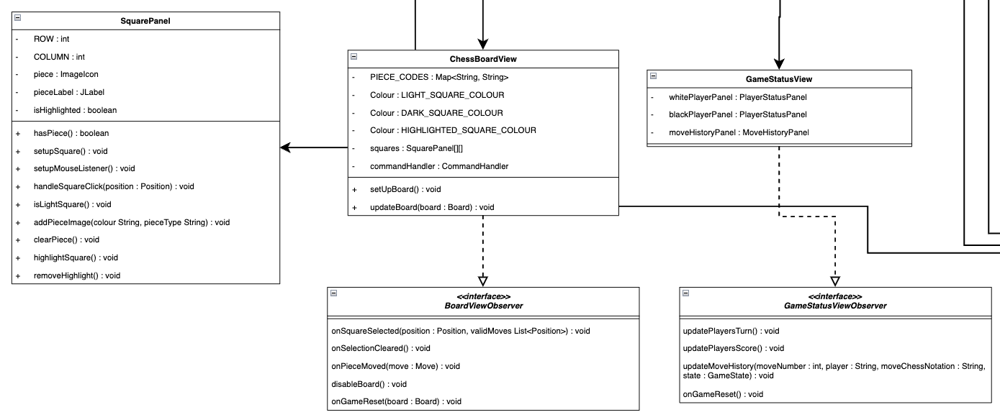

# ChessGame
A Java implementation of chess that demonstrates core object-oriented programming principles and design patterns. 
This project features core chess mechanics including a clean graphical user interface, and game state management with 
move history tracking.

## Example: Fool's Mate 😄

## Key Features
- Move validation system for each of the pieces.
- Game state tracking (check, checkmate, stalemate).
- Graphical user interface with legal move highlighting developed using Java Swing.
- Move history and proper chess notation.

## Technical Implementation

### Architecture Overview
This project implements the Model-View-Controller (MVC) architectural pattern:
### Model:
- The Board class manages the board state, and handles core game logic (move validation).
- **Key domain classes:**
  - Piece (abstract base class)
    - Concrete pieces (Pawn, Knight, Bishop, Rook, Queen, King)
  - Position for board coordinates
  - Move representing game moves
  - PieceFactory for piece creation
  - Player class manages each player's score and captured pieces.
- **Movement System:**
  - IMoveStrategy: Defines how a piece can move on an empty board, without considering other pieces, or current game state. 
                   It purely focuses on movement patterns.
  - MoveValidator: Validates if a move is legal considering the current board state and game rules. For instance, it
                   checks whether a move results in its own King in check (invalid).
  - This separation of concerns follows the Single Responsibility Principle. The Strategy interface handle 
    movement patterns whereas the Validators ensures moves are legal.

### View:
- The view is split into 2 main components: the ChessBoardView and the GameStatusView.
- They implement the BoardViewObserver and GameStatusViewObserver interfaces respectively to allow for the GUI to update
  automatically in response to changes in the model.

### Controller:
- The GameController class coordinates the game flow.
- It registers observers for state changes and is notified when events such as when a square is clicked occurs.
- It also notifies the observers when game state changes (i.e., when a player captures an opponent's piece).

## Object-Oriented Design Patterns:

### 1. Strategy Pattern
- Movement Strategy (IMoveStrategy):
  - Each piece has a unique movement pattern, but some of these patterns share common elements 
  (linear, diagonal movements) Separating movement logic allows for reuse and composition 
  (e.g., Queen combines Rook and Bishop movements).
- Move Validation (MoveValidator):
  - Separates complex validation logic (blocked paths, captures, check conditions) from piece behavior and also groups
  common validation rules (i.e., all sliding pieces share the same validation).

### 2. Factory Pattern:
- PieceFactory for creating chess pieces which makes the board initialisation cleaner.

### 3. Observer Pattern:
- BoardViewObserver for board state changes
- GameStatusViewObserver for game state updates
- Loose coupling between the game logic and UI

### 4. Composite Pattern:
- CompositeMoveStrategy combines multiple movement strategies. This is used for the Queen that combine 
  multiple movement patterns.

#### Full UML Diagram Link: [Click here to view full UML](https://viewer.diagrams.net/?tags=%7B%7D&lightbox=1&highlight=0000ff&edit=_blank&layers=1&nav=1&title=Chess_Game_UML_Diagram.drawio#R%3Cmxfile%3E%3Cdiagram%20name%3D%22Page-1%22%20id%3D%22TetQjo557UKkMTPRmtvp%22%3E7Z1rc9rI0sc%2FDVU%2BL%2BLS%2FfISY5L4iW9rnM3ueZOSQTF6AsgrRBLvpz8zkkZIzAjJgZmWXZ1KJUYIMOqfZrr%2F3dMzMEfLXx%2BS4Gl%2BFc%2FCxcDQZr8G5vnAMHxHd8l%2F9MhzfsS1tPzAYxLN8kOVA5Po3zA%2FqLOjm2gWrotj%2BaE0jhdp9FQ%2FOI1Xq3Ca1o4FSRL%2FrJ%2F2LV7Mageegsew9mvQA5NpsAi5075Es3ReHNUdf%2FvExzB6nBcf7RnFF34Ipt8fk3izKj5vFa%2FC%2FJllwN6m%2BMj1PJjFPyuHzPHAHCVxnOY%2FLX%2BNwgW9rPUr9r7h2fJXTsJV2uUFy3%2FtszP9v763evf%2B8%2FXN1T%2BPd%2FN3Rv4uP4LFprgUA8NZkPc7Y%2F8PH9ZpEpBrbjiPxXH2%2F8AwiQHNs9sonBbfep0%2Bs2u6%2FhktFwG5HObZt3iVTopnTPI4WESPK%2FLzlPzqYUIO%2FAiTNCLmGBZPpPETOTqdR4vZZfAcb%2BgXXKfkWrNHZ%2FM4if4lbxssyFM6OUCeTtKCLEurnTGhrySH6dEkXJNzbtlV08tDl8E6Lc6ZxotF8LSOHrJfmJ6yDJLHaHUWp2m8ZG9EjR7OikelcbMHaRJ%2FL0HSs4uVXWXyLcNfjebTSyjIfRbGyzBNnskpxQtcxzi18xcVN5nhugWFP7fMmrqXH5tXcDU0q7hXivvksXz78hPvyH0VrB7JVy4%2F0jC12gfq7K6ufJ7uaILPc%2BofFyyImVdBGp7Ri7auYkp%2BqHzb7aEM3heAbApANgcjYzDU%2BH8vyPPEUEPy7yRNotUjBy%2BxU1oBdRF%2BSxsxXT8FU%2FIel9k559b2yF1xReihmLz22yJDZB7NZuEqQygN0iCnjHLzFEerNLtk9hn5Sy7sSCM2t8kvNCKP9e1j8peenqSjeEVvzyhjKCQI%2FwwpxrU7TutEX%2FPwwCNZ8CDAQYyf00xfjYOXGt16idGj9Zd5lIal5R%2FIBBMGqzdn%2Bj0D0zxdLoofZTHhOMBM2C9hIj%2BLEUEvJdJwTBp8A5gGZw8NRgHB1c2f469%2FDi8vzof3N3clDUtiqT%2BJ3WdBGifIxVG50BkEYGC4AjB2TLyIMue1uBy60LFrsf%2BSWJK%2BHTP4PeXh%2FJ3OQWHyUJgCABbBQ7i4jddRGsX0%2FZP83B0w2mwvzaqW1c2qniSjegKjntHwMkzPgnU0vSI32frkKV7ndzi7kP8p7%2FnLaJ2ywIeevA12tIF7FrBQyD1%2Fc%2BNB1WE0pAFiQ88HfjMhw4eHJPwRBZSIky0SLEBAAI4BgAs97jPFqULAbfCTjwIa1IvqmC9LvSDf%2FcXqRX7oKvhVO%2FGlmsZPGiBNCIr0nJ9J8FSf%2FjpRsV%2FFsM3iDiyAMDXbFxDhCuYMaUTonV0Bfv7%2FFi0Wo3hBHETzPNP%2BXqlLkH8z9k2i1TxMosNcBV0Tg8DEK1GcKDK7LKuLlM8j%2BQpveGY4QEtqAcIU%2BY4CIOTNDCIJsZtvgAb%2FDYM7IvVQqcF5%2BfAsWs%2BJWdAZgHEGDLcjE%2FKcAZF8iM7Awc6A1W9nwOGMHM4eQ3afk0s1jx%2FjVbAYb4%2FuKGjbcy7jzIjUhv8fpulzcSMHmzSu30HhajakuestLdmN%2Fz5aMPmtjphRmoD%2Bcr9jAPIN400yDfed6IotlYQLMvv9qH%2FsnnTibZyp6exWNz3v1Pd0i%2F01azf%2BO9s%2F3T5neWUWgX0AuS5kFi7e0zh68lAXqYHoDMr0DfYPCPDO4B4pEZ3B4xsc3hnklcFPq%2Bxz0RmEcQZ1xwR2Bg1eK0Rn8AjOoN9rZ5B9jzfsDPodnUGjQc0%2F2Bl0T33Ds13dyv7Vd5xB59RyfHKSa9u6ZuhqfUF2j6MvqMw12D8egPuCBgqDSg0O7gsavDD4xyYMMUmoyBX03bo80AdXEHVBGa6g0W9d0HjzuqDRVRc05OiC7yyndqtb7qlW%2BWPZtlrnD4VA1SsMei4EGigEKjU4vPMnEAJF5kTfT43vB58TNlEGlOL79VsGNN%2B8DGh0lQFNOTLgO8s%2BdW3fYH9tb8cVVOr6maj7qfYEeq77maj7KTU4uOvHiFM95JPf%2Fa%2Fqg7%2FpmxHTFA%2FPmc%2BWP3o%2BZCJgk1rrkF9c43zQ3XOi3eDOdZ4bDrOY%2FZosFv6K0r8qP1deRR5tX0Qf9MvKB3sAh1lZtIrXCZZ0uGS9SiqPLmjU9Y3GKOzwY%2B0k9ig7%2BSFh0%2FQFnbPJAB6k4eNzn8I9S3%2B74Z5umfWmJqbueKzPSXUicAx%2BInBtWcB1Xx2MEV%2F3%2BT%2B%2Fjxvnf0vvZnZpER8v9bX4%2FtSTIt87a3%2BUP0F%2F5CKCythUxAW1gUjsLNYvfwHSy9nqr1N5jMHltzATLDgUYSbPzeQVxlG8fKJMhX2dg96y5Kj72o7mqAmWKVuaoNEVC1mO39lI46zfU%2FVpFqzn2WdurfFyKcrsKkVZh4YbTVKUf2pW%2Flhe3SvRDee0KFaj%2FzrezhwkWZtiMyP6I8f1R16sQAsHAVn%2BiNWgSOaBC7nuqxoBzj%2BbuJxX363zEZN6IU9JmAc8xQn1Do5%2BJRgiv2b%2BtvkJ6P28Ru%2FnxaqqEGp5PftMmJntNyWb7Yz4sIipz0MPVSZE8qj4UP0482NX7Yb1WmrXbhrcYTXajcXXUp5HQWY89HVBfF3rdFdxcQWpVt9X6e1idaUM%2F8Z6eXWlyOzS%2FBuRrIv%2BDfo3h0AtyhqLoJbn37hvNXLv7Jl4UmJ03bPNU6fyZ2caMzTv1KqsKlMbofPa8SWZsIIEnRwYJ2eHDUERoaUJRF95Lo6o8yS6OAe7OA1jzT4JR2FKyRaVjqKLgy7OIVALJRyVCSybl6Pv4vg7Tm9AJfLwPVRZX2ec3Y46uzUV1%2FWkRN4GknLVlcjbXWMeuyEqPXx55I5ap7gq3hZtsYNV8RKLpFvuefCqeFuk1WJVvDSDg1fF20CL4IuEHbEG%2Bbq1pJ3vWoO2tB15dEvmX3IJqHt5pFxeh2mk64TB%2Bo%2B3pu8a0rlqsnc2kJjJkrWnmmbVbW9uYXiJ7ftRRn9wE4XDjClayp5PzFFFUGisq49%2Br67%2Bqr6PVilTRI2eAGDcmGkpbzRu1E0u92t4LFCrigmOYEMWlkM5PpUojEoJHVs0JF4xEJpdVujo8MIosSW5pbORIg8qHsr44oV6JNU0H%2BIgmZWvO6OPUNaElTVbkGSRbRuS8vaK5GXNabAaBU%2FpJgnZLX6yzEgpQMqxaeWtZatZREoSUi7fNk4xUrwueh2vJmSIIwZp3lwUUjh%2Fyw6Qr%2B%2FKaYbb1QHyZDlAjqjNADpAhzpA%2Ba3XrJ1DO0BAvQbatPNaUdDxhHQ2ELbG0nlVz%2FGFdHc39NFt59SrLfmpv6dkYd3hZVR0gN%2B4t9IyJJngDjBfkIsO8KtGStA3WTFSfCcF9H774%2F16RscxR573KxKl0fs92PttyDT0xfvlRV%2F0ft76VLUfSXDvx%2BUlafR%2BXjVS4N6PyyvKt8HPFbo%2BPXB9%2FM5zoCzXx%2BXFYXR9Dnd93JaiWWDXx301RbNH6ezjdi2icSVV0LrWqWl5nukamm9qBlsoUdlszvU1x3cd17J0zzLUbjji8vW16Ai%2Fca%2BlZYCCd4R5aRod4VeNFLwjDF1D7PveYKeOdABSQixr0T1TVFprUPPKK6gaVBe2oFgbvKj7E28%2B3o%2Bq25%2F3qshj9opZFCzj1ex%2BHq1qqNC1ioWfwXib5GNV9V2qXB0RHFsVN2L%2FTDd879SyXNMhvpeu2fWljYbnGWr9Me9181kbXl46WrH%2B9Pqge3%2F6I5LouR1R9EE7mrk%2BBCItdRk7ljymVbSOVtG1QyO4g8zi8fLtWe6L9khje8Or0l1Wv8vqa3xd5HXqvNdpWrLcTo%2FXX98pbL5Rj4Wy1hqFJpb%2Fi2HQ78O4Zwxolv4E3WBEQEoLg5gzg4rvURXfFrOz5hRtZpel%2BHoN%2B4ipbAKUDT6ldpM3%2FKkNTFuRZtsbCIcnpcOTYKW34uGpodmDclCH6clTSeEOlv%2Bpc4uUKqbUA59EGxpQKKM0Wt8G6Xy0CIOEYjqhDr5g9Mw6q8Xr8WqGDPeMYV3v6BLIgxi693G0nvyzIZfxZjrdEHdg1mXAxfQNEK5sZzI4XPkybpWB9LqDX1BtZdng2f6II14OQnglw%2BsI2lWqhVdUYq5yrK1kzymQJ9%2BSeNnAbxo3wYuDLxC%2FPnhYJuqQojgsq5QjCYbYovTj9%2BqUsByp1%2FyTARyYf5%2FP7Kjlfxl8zzbm5Gue0LeAZZNtkQfHpmhnRpVsblazGNnsI5sOdNDmi7JNajWGT8T2F6vRPJx%2BP4nWX%2Bg7f8pawdadWvRywWn1oaM0HzpLNg%2FWFS%2B3oBVJ7RuppgEdj%2FmiNNkL%2Bqhe%2FF4f1YuinKnnDVS9wZstcdLLSiU2amqmAEYGXhVG3bBk0Yh7Z8qoKfFbthkUOHciu8uqKfGh80cNNSVYUKJyqmyB1BIoNyJI5c2UfNoIrqAE%2Bewbn2wBPByf0JkhkbK%2BK6svM0W9QSDfsttVUhe%2FAtlXzL7f0YGQxz6fVcqgex9M0zjBvWpVxRTWTkcC3fN4KcbwNNa%2FRMmmDLomyrlgVHFwVNGwm0%2FzAoUGy8uKK3QNOqExTcIgDS9WxHTBIpM8smFpfbJbNFlbSVPMZauH9RPOZjJms%2F3gCnalawDXNKSRC53ueEriZZyGtMPXyRP5p4CV%2FMTV%2B%2B7iiviC4ut0HndNUxq%2BQH2hipXn77RTTSuP5Cu%2FNcsf%2FEaTjMNbyHdem1yc2GFtsiEGQM3a5GJpdG1sykub0MlW4WR7mr7b%2Fs8SlDWZbKVgTbln5UcSqOCle6VV1dT6xElGIUz6%2FNPYG2HPTt4iGKWpAbrGJxRUshiuZkhiH0gULJZWTSLsWhMqt85uRTXOiKJaFF1eIlWNIp8fUIniNF80skPjzRMdGYkPV5f1a4ElavogxJZ%2BPiCyvKyvevS8f37iJY6yLDl%2FFslUTKagUEkxmTqmFGSkFFotb3eMLaSlFHTolMJjmI7m4Xp9TU1Ka5VI5Fsp7f0QLMMJPbKVaSdpkpWp4zCleJgSLBZWPUzxaYTbRfAcJhwNKNZJEesMVttYbtHrCeYuFiUqkup0fnWCSreqYTUCDlBHH6D0hkTBHqFOhKLE8YlPJYDFpPsWemNA2gNcRWqeYlyBcxzTONkOm6xpODKokEGRjKeYQdFiCYw8D448WwwvVMNElpcXefZg%2FcFwSusLihq2vCN0t62YcALtweAl6hSoevSCXqQQzGajqte3ZykNdpoAgVSwGlE1pNA9qqL11XMbnRg1QwEqkvXUAsq6BoDtQOa4OzuQacbgN4orVW79UjpwrfWVDeZXVF1ZfiEo22qavWNb1%2B29cfWuO3%2FZsMbl9Xg2BTywwb%2ByppHNDQ%2FbmaObbJ8p4Afp8YKp4q1K9Mzh2FtNa%2BmnrqCEvmzaJoEVWJWeAIBak1xHw3i5PN%2BEoTxXA1ahT4LVd6QQkkKR6q6eQuwLJEX0bLG9SO1usL002dMQ6d1qg%2FGb1SRYhu%2FJhEg79g926%2FoxJgcfpAT7%2BAAMUtACPSP1jkyaSGo%2FSRVq8OpRhZbhGarnUZAJFYhrT3EVqfHqcYUX5LPOVqM4TmbRKkjDk2n5YxmbIK7wuIq0eeW4mqLFAYoz9dRbPY%2FWabCatnmtGFZDkCrYiQeA1B6sZqDeKpLaX1JFe%2BYAkMoLPirTYjvNZMoMWUNCTGXuiw0krakvU2zmzqmv7KXDJAmeKycUhG%2Ff%2BTbO7tKyJWApIG5x8qo4dHiFV0yoW4Dy32KLU%2Fl1DiEMtmeRfqppVp0y3X8FWXWvI32FPAKWemVd3cDy6m49rd5i2Za%2BUxKHE6OzQRvmDVUGtYENqjm1WYHcwJ4j5X4lD8mAl3kaD4uYZt7pIeLhL4p3OOYNzRaHtdrfB5lPHH%2Bn95VXVOs1TSfcC8yiO1DTC1x3%2FwtkTT8OCM6%2ForQ6PJGH5ehEft5iTB%2FUKP6r%2BqB%2FXpFu%2Bh05znfUhRvG3Fdo99PaXKa%2FSrvrDrBD4kEYHsAWh04R3Aj9znDcnRaIxFXWTq3Kn53WpjkNxfvsWO4oozevUNNODCSYJ9d7scAF96qq%2Bd7ZjlufvkU9Q2zWbL4qXri6tBX3Fq8IA6y4v98kK8xRSNfTmka95rI%2BIY7ytDSLV31Vt9X6GK3zjTkaVwzibunwqApq%2F1SjaoCi%2Bkjm8GKnSq2y0hVJVE2ioBJRNYmw5fjZO7HeTaJ2hA19nZBMyWSKGgOoRhO2Rv9hQeIHRLOHaAr6ZKpGE7ZjznST0Gs4yVskitgs%2ByUinsrx7BqYS8QTdqOAdbgIp2k447axrA%2BfuH8AFKEefAAEu4FAMYBu93XFiL3XxBoafKAEu89A1pXqzyj8efOwDpMfTT7pGX8asqqYVcFGi6pZhd1g4LFwPjfrdmA%2FNJyL1KqW78GDKhs3H5CyGrrN8oJVpkLLS1sLbUOX6yfhI3H7woSbPU8E067WMNNihz3gEcwHn3dZYqkfIOfTah3l%2BrE6zPXnEGdYnE0DfkLmc0Nqcc6qe67Dn9RJPEEggYG0wHVNm88IqV4wTVG8ocMpLouGJ9IF1zFtUQcnxStNv0SrVQ1ITEwC8eiDq5Q2cObnZ5RO57QgE6drYBgtAz4cgk3yPCXxNFyvaf7m5FsSL7fjY5l5JF9MS2PuCWQXmF0bPvaBTfeEv8LpJg0zdvMEpEbrixFMYDBd%2BBgINrezeZoFrGJzPaE7dyGf%2FeHT1sAjIgd2TVDO59V2LQbi2SM8DfAAyYFdJJTjWVZnIpw9gtMGD5gc6PzRZjWL6eLXzO9EIIGBFOyprRpI6AzQY1gp0nwfJ8X2YWUA3xi4Yx1nH5F2NPD4yYHOIc2D1WwRTv7ZkIs5WkTT7ydT%2Bm%2B1XB7lqH5Ry7o0AlILu%2BCoaBSduQXhaksq9jXvGak2fIAFm4GaEvCSSbYAiSCJWfoeMOnBx1WiLUyqvmH9UbjaLMMkqC1de6ydxh7lWxwmDL7mVZeAbZEsbfB22yK5RYDCVra5bGVutasz6%2F1Yha2s1ZRAG586urj%2Bent38%2BFuPJngAHT0Aaip4x1L2gha0ouQkDj%2B8Dmb0cfx6BOyoJoFh48%2FFbPg8vmRjIWr4f0YeVDNA2sLDcgDn5CY3A8vx8gDBA%2B6LtgYSjEQoiTADge4DO74lrcEeyyJLC9tGZwrEtslRClUxbl%2FfsIgRVWQYrF2f2WUovkdRxnWhUsCbbwOfn1zdzW8xEnn6JOO27CnQG8CFJeXl0fD2%2FvPd%2BiCKKehByEKL%2BGOhpP7S4RBOQw9iE947fR2%2BCXTs65u7i9urhEK1VD0IUjhNc4xYWI4mQyv75EI5UR0DV4kEsFrnNk4cX7z%2BQxnDgAkXHCv0uOlTo4DVDKOb3m%2FowcpTcnwRA19JCgZWTXgn9mHoJahRMsw6%2FsTmbqgbZh4lGFNmyXQxgumdObBKefoU47XAEdvdAyPl1A%2FXV98%2BIguqXIY4GUMj1c4zy4mH29uEQbVMMDLGB6vcN7d3GAFhnIUeiBeeLy%2B%2Bcfn8Rg9BvUwwOsWHq9vfrq4%2FoAsKGehB4IFr2pyHKBgcXzLwwsWvHgJsc5xU110y%2Fb0xUFI4SBkCLY9UzwI%2BRpndhU7pzdsgq4NerQJul%2Bc2boJuqHbYjMr2gTd5wXQ0TxcZ91DOeviltlyyq70sra23DOb6UPVu5vFprXVIbohDQ1erVS9N0d1%2B3Ztuw1H9bCy3wenuKNPcX7LFCdwtkT3gMQZDnbPWXoL0I0byuwStyFN8SzeA2%2F1HhDsAK76HhC1ocBQ8%2BBQs8Xwgg23hYaXFmn6oobh%2BahAnT%2FhSDPNLxAdY5LHhxODNh2nnWu14r%2F%2FNAw7KgPYJbHuCXHztjspTtKEQJRzsNvBRBu41A8liA7c88o75pcAR0WYUVGwEZTqUdGBiH1bY9htcDyohsbbSLkhOD5q7Gt2jH31fLXJAbFv8dLbOJOgynjKYatWmCNpsK407E3y36143Q4L5S9yCB4uBB6%2Fa32l0ggzRTseunUgHgfe4h6IDX9F6V%2BVnysWJI%2B2BqQPnqvWzCUxwzGrttdPNa3N%2BtmjW%2BLQkOtGpRsAJLqqZbreMC%2BoQsLH27qlDX27DU1QG2bOaINfG1WcyMYa0IgKnN%2Boz%2FOiClDBfselMxk1epKQxaHG4A0rrrbtne5UiGo%2B35HHYtvU1DRXT1aFqKGJ6pEx2D402C5u%2BuZ6UF5lEVpeVrBtsG74FbvHq7zzZt4iLpw195LNg%2BsfZffZgaip7Pbk6jiFDTvlBrJt4Am2jxGCJy2QNTRe4ibksbaEI9qkkLCHnMByItjNRTUnvAwcr7JlLXTMmZ0s8%2F0BckiucJcAcGR0wQ4rqpnhJeRZtKbXOfOGcVSBRkSwy4lqRPgK53hFM5t34TpM863AS0oyahAaYGgEu4%2BohkbYJVd6CM%2Ba5m7WGMf3JY7XLPP343jW7XRPauGO%2BMHB6nERVj7UcHc%2F0eSrtcp2JNVPZHEm%2B8BgQUy%2BClIyH25WszV3ZxwhFWFoWCouR1Jo6eULLinwleK1LRFx72Mlk%2Bl%2BSuDjf52XwwU7ZyInsJzAx%2F86r0zzO1hSEeB6s3yo1OtmGXaqTz5lPA12im6yp%2BjLsqrza2q6qsRZPWud71dQqQPOdjBANGHR7KwzWNJSeqwGviGIREKACbF491j16GVyZsfEfXUBUpfEvd3QzUlR4l63QGxY1ONopy4rwvm78lRrQU5v16h1N3xRhA5neF5G3q596I%2FQ8saXqJnGjtBiWALZw2TGqgktvrSCCR12E7ezm%2BHd%2BdfJxX%2FHdYd3p2wcPY4jexxNq2b3rBwTgSnR4eAlapVcvr8bXo2%2Ffrk4v%2F%2BIYPYITNFyLsVg8nKwejA%2FjvNWd0hmb8gUrTdTTCYvWCvdj5UKUGWVbsnmaOcwcqmWS13Y50QpmAYvkateBb5NOzevBa%2Beg5QqptTkEzmqKeUFesh2HSJKd89BShVTaoPHRaz4AKsRjluN0GZ51nq8zfLSyhEMYAX%2BZULsLFjPs89tXHU9TJJswHhYxFTmo4feR%2FSaFO8mTbY1Osu2TYV8imRbo096fSnRt%2Bj1g%2F4majobXrd9WMML9ujbH0Whai9rmaOxu8zRcC1RZxlRNna3WvGIhMCq9rcX49H46%2BjmfDwp4%2Fwrcv1rRcLV0hP2c70%2BGN3XI7uvxstVfSG48rxXWFWfErRJSmQvqYj6dfLH5%2BEdpfny5vMdQqkaSmGDNrVQwir6O1CeD%2B8%2BIZOwTAp7x6llElbL32HyIxkos8FyfI5owqIplPPVsmnCyvnrrKvDWqyQ5i0fbkkotCiUpPxf5FQ1pyJBXzGn%2FRf0d5txI6WKKRUJ%2BoopRUFfiqDfZnmRoC%2ByvDRB3%2BQbx6ht5LsO089P2EiiF%2BOQDz9bitqUq8QxXw2X84htK3qHaFkpDogonxep%2BvuYFDkSHy1JEUNjBV2lriza9VXUT9z05U2nsCmRu5svg1o5Lo5PRx6fzN9IbggQlDg8ASc3bi4%2FX10jhJAQgu82Y5iwyYwn2tBQrHVcLIPH8GJKmxMglmqx7LoXjkQsYfMZGZaXVKoox8f%2FKx4ii2pZFCcwlMJowSYwovVH8i0X9JuGM%2FFY%2BRDHizDAkVI9ncK0hVo6sYW9FEG4zfLCVIDA8tIiWFYuCKbAzYN11pC6IgfjQAQ1EDnw02QPEhSbp1zhwwwFNI%2FCDIVaHqEzFBmPV%2FFmHdLtQcJVmCCW0KqfMCuhFkvRPq9qp%2B0V8eDycXK0iKbfm3e6QVyBcRV0NVaNK58nUYtrtL6k3xPn9X4Q6YBrg5ZoNwKVRAazWRb3ZAr1yZTVPlcXMGUC4v3zU1geR3CBwfXhAyTRzgAqwZ3S3cV2Q3bEEQJH04CPj%2Fgci2JHlMnaOLf3g0kLPDiy%2BVSLWiaTcJn11y%2FIRCahmXTBIyBb58yutK%2BG%2FDbYPe6%2BwipkOnRfaWiKr6gJB%2FtFd5pm72kSh%2FWmsvYo84sXlS042N5g1UHEE%2BwXppvSsnU2nx2BXF2m4YIyJdNbUyv%2FPVWoIjAlzm58lkQll9k75VtfFVX5ovqW%2FIR8LBUX7yOpkkkVlaoqJpVPnKgk9WFBJkkktf%2BkiqpXFZMKu7Zkud0hbg%2BpV9xZCKpaUIWlrYpJFeVSdjjA4sHjW15UNiqyvLxwxAMRNV7DPl1MmW%2BXHJqWwKqSHHxQG%2BqD%2FvZuNTvbsEl%2FVGRDRwO%2BDzXNrNuRtrbeb8ns0S0ZJMk1oOqUevN2VgV1x4E1r6g4v9r1tP7ofUSsWB56rJ3AHmUnPiTlMk7a6Teb2QI65fVIZLT0wZsVGXXfrq9p1z1N56d0tlVvfVteUxptvAatNnv2%2FuJucv%2F1bnj9qVQYca8pBYGG00DrM0OuG5ry4gwHem3AZDy6uT5HNPuGpiPIzChGE3qZwGT85%2Fj6%2FiOy2Tc2fcF2u4rZhF4rkO0biWj2Dk2dbd4IyCb0woAvHy%2Fux1%2BzvSUmBaEinRtx7QGubNETIK7QqwYKXIdfrpHWntPqwsdL0EsFzi6Ho084uL4KXH34GAp6KUGBKw6uvafVMMCjKhd6kcHdzc2nr398Ho%2Bvv04uzsdf319cjpHY3hJrgcdazCEBI%2FbTdbb3GccsSgL9wdQFj7HYWh0wTHM%2BEc2eoWl2zY1KRBM6AfXp4voDktk7Mg3w2MmFzj%2BdXUw%2B3tx%2BzQDFqb2XlNrwMRN0JiqLmZDR%2FjLqwkdJoozUDgdYzH786iKtY%2BAhrZidLe%2BFKqIdvKgQun21vaSyWZ254e1V0Q5sVbTLpz%2B2Hbcu42AmWKuMy%2BklLaf3WDKqVHAFa0EtQ7ScnjWBlUAI7AYRWWLs6%2F3ft%2BOJWLgtmsHhbsJynJF8gHjJsnohoPJ8EQ92z4h8u3Vks4dsdh08JbIJu9F1RCfxUTCdh2UAd0Uuf20hTLWXZmUjqPpSGIz4QEEWrLNXDbIo34AB38EBX4vhRevWhZaXFvB5sM2UFiQCGS4WWUiyFu1%2BgiMT6Mik6%2FBzLLSqTwJ8UZPqmgfItaquPrvFujIBI9iwYJvwcy50IiAXSnKso2ll04oKpqPyEtVSBKPtVaocR9B7CLpgOyvVoDuc2V9Vh5TB8YTjYtBp77bgNWiJnWXj7KXDJAmeKycUQG%2Ff%2BTbOM34FdC7rYbht9W9U7d%2FhBUXvnaYX6KzjcMMLyA%2F5L73lrfz2hyAIk9coOw8b1dbD2mBf62G1HXrsjkAWs5VqIN%2FplllvD2HYvr2XsHe64xl7X%2FJSxsjDJKZT6%2FZ0MoDPr%2BJZSM%2F4Hw%3D%3D%3C%2Fdiagram%3E%3C%2Fmxfile%3E)

## Other Information
- Java: OpenJDK 19.0.1
- Build Tool: Maven
- GUI Framework: Java Swing