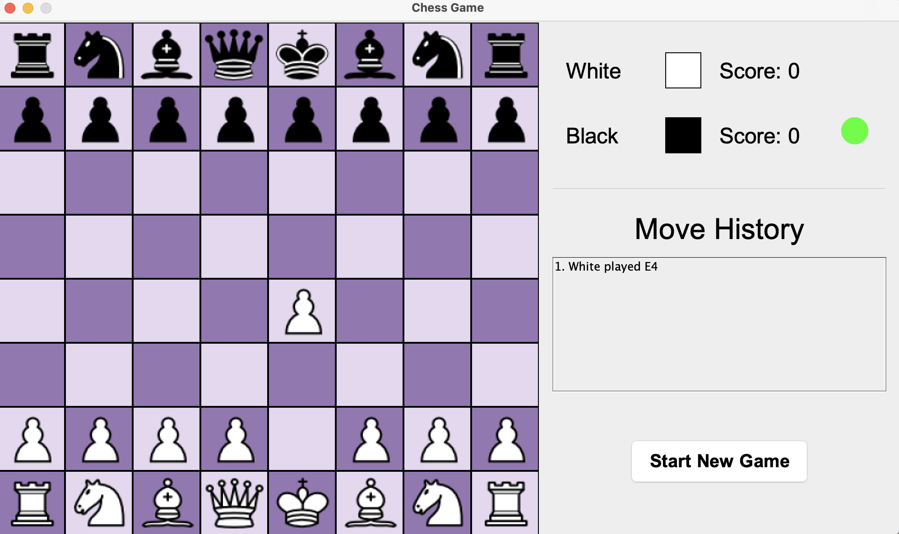
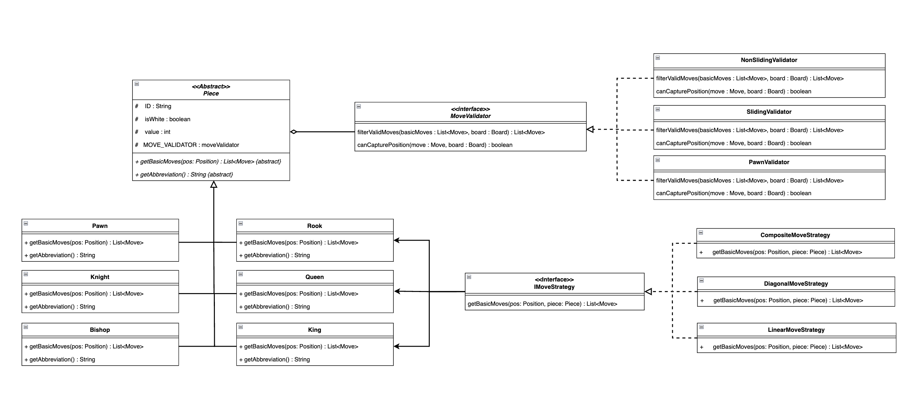
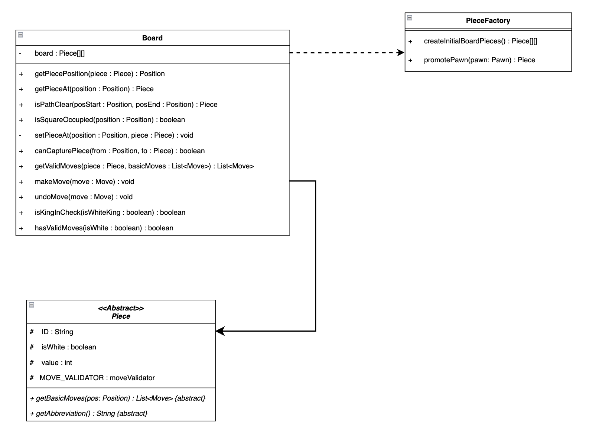

# ChessGame
A Java implementation of chess that demonstrates core object-oriented programming principles and design patterns. 
This project features core chess mechanics including a clean graphical user interface, and game state management with 
move history tracking.

## Example: Fool's Mate 😄

## Key Features
- Move validation system for each of the pieces.
- Game state tracking (check, checkmate, stalemate).
- Graphical user interface with legal move highlighting developed using Java Swing.
- Move history and proper chess notation.

## Technical Implementation

### Architecture Overview
This project implements the Model-View-Controller (MVC) architectural pattern:
### Model:
- The Board class manages the board state, and handles core game logic (move validation).
- **Key domain classes:**
  - Piece (abstract base class)
    - Concrete pieces (Pawn, Knight, Bishop, Rook, Queen, King)
  - Position for board coordinates
  - Move representing game moves
  - PieceFactory for piece creation
  - Player class manages each player's score and captured pieces.
- **Movement System:**
  - IMoveStrategy: Defines how a piece can move on an empty board, without considering other pieces, or current game state. 
                   It purely focuses on movement patterns.
  - MoveValidator: Validates if a move is legal considering the current board state and game rules. For instance, it
                   checks whether a move results in its own King in check (invalid).
  - This separation of concerns follows the Single Responsibility Principle. The Strategy interface handle 
    movement patterns whereas the Validators ensures moves are legal.

### View:
- The view is split into 2 main components: the ChessBoardView and the GameStatusView.
- They implement the BoardViewObserver and GameStatusViewObserver interfaces respectively to allow for the GUI to update
  automatically in response to changes in the model.

### Controller:
- The GameController class coordinates the game flow.
- It registers observers for state changes and is notified when events such as when a square is clicked occurs.
- It also notifies the observers when game state changes (i.e., when a player captures an opponent's piece).

## Object-Oriented Design Patterns:

### 1. Strategy Pattern
- Movement Strategy (IMoveStrategy):
  - Each piece has a unique movement pattern, but some of these patterns share common elements 
  (linear, diagonal movements) Separating movement logic allows for reuse and composition 
  (e.g., Queen combines Rook and Bishop movements).
- Move Validation (MoveValidator):
  - Separates complex validation logic (blocked paths, captures, check conditions) from piece behavior and also groups
  common validation rules (i.e., all sliding pieces share the same validation).

### 2. Factory Pattern:
- PieceFactory for creating chess pieces which makes the board initialisation cleaner.

### 3. Observer Pattern:
- BoardViewObserver for board state changes
- GameStatusViewObserver for game state updates
- Loose coupling between the game logic and UI

### 4. Composite Pattern:
- CompositeMoveStrategy combines multiple movement strategies. This is used for the Queen that combine 
  multiple movement patterns.

#### Full UML Diagram Link: [Click here to view full UML](https://viewer.diagrams.net/index.html?tags=%7B%7D&lightbox=1&highlight=0000ff&edit=_blank&layers=1&nav=1&title=Chess_Game_UML_Diagram.drawio&dark=auto#R%3Cmxfile%3E%3Cdiagram%20name%3D%22Page-1%22%20id%3D%22TetQjo557UKkMTPRmtvp%22%3E7Z1bc9s40oZ%2Fjaq8F1bxfLiUZSfxF5%2FGciYze5OiJdrmRhK9lDyJ99d%2FAElQJAFKlEWgaVenUolFUQezHza6XzQaA3O8%2BP05CZ6fLuNZOB8Y2uz3wDwdGIZleyb5jx55zY4cu66VHXlMoll2TNscmET%2FC7ODOjv6Es3CVX4sO7SO4%2Fk6eq4enMbLZThdV44FSRL%2Fqp72EM9nlQPPwWNY%2BRr0wGQazEPutO%2FRbP2UH9Udf%2FPElzB6fMo%2F2jPc7In7YPrzMYlflvnnLeNlmD2zCNjb5B%2B5egpm8a%2FSIfNsYI6TOF5nPy1%2Bj8M5va7VK%2Fap4dniKyfhct3mBYv%2F2Scn%2Br99b3n86dvV9eV%2FH2%2Bfjo3sXf4J5i%2F5pRgYzpy83wn7f3S%2FWicBueaG85gfZ%2F8PDJMY0Dy5icJp%2Fluv1q%2Fsmq5%2BRYt5QC6HefIQL9eT%2FBmTPA7m0eOS%2FDwlXz1MyIF%2FwmQdEXOM8ifW8TM5On2K5rOL4DV%2Bob%2Fgak2uNXt08hQn0f%2FI2wZz8pRODpCnk3VOlqVVzpjQV5LD9GgSrsg5N%2Byq6cWhi2C1zs%2BZxvN58LyK7tMvTE9ZBMljtDyJ1%2Bt4wd6IGj2c5Y8K46YP1kn8swBJTy9W3Va5%2BegvHv4uHcpt9zmMF%2BE6eSWn5M%2B6jjG0sxfld5nhujmFvzbMmrqXHXsq4Wpo%2Be0Y5PfJY%2FH2xSfekvsqWD6SX7n4SMPUKh%2BoWxr3ebqjCT7PqX5cMCdmXgbr8IRetFUZU%2FJD6bfdHErh3QNkUwCyORgbg5HG%2F3tOnieGGpF%2FJ%2BskWj5y8BKjrEugzsOHdSOmq%2BdgSt7jIj3n1Nocuc2vCD0Uk9c%2BzFNEnqLZLFymCK2DdZBRRrl5jqPlOr1k9gn5Sy7sWCM2t8kXGpPH%2BuYx%2BUtPT9bjeElvzyjFKiQI%2FwopxpU7TuPp2%2BoLdiOZ8yDAQYyf00xfhYN9jW7tY%2FRo9f0pWoeF5e%2FJABMGyw9n%2Bi2O6Wm9mOc%2FymLCcYCZsPdhIjuLEUEvJdLQJQ2%2BAUyDs4UGI4fg8vrPsx9%2Fji7OT0d317cFDQtiqT%2BJ3WfBOk6Qi0650BkEYGC4AjBqJp5HafCaXw5dGNjtsP%2BCWJK%2BHTP4HeXh9FjnoDB5KEwBAPPgPpzfxKtoHcX0%2FZPs3BoYu2wvzaqW1c6qniSjegKjntD0MlyfBKtoeklustXRc7zK7nB2If9V3PMX0WrNEh968ibZ0QbuScBSIff0w%2FmDcsBoSAPEhh4P%2FGZCRvf3SfhPFFAijjZIsAQBAegCABfa7zPFqUTATfCLzwIa1Iuyz5elXpDffW%2F1Ijt0GfyunLivpvGLJkgTgiI951cSPFeHP56KvVUM28zvwBwIU7N9ARGuYMyQRoTOEdEUCvDj%2F0M0n4%2FjOQkQzdNU%2B3unIUH2m7HfJFo%2BhUm0R6hQ3FWtPYEhyhNFZpdldZHy2VGs8IFHhrZa0v5AmKLYUQCEvJFBJCG2iw3Q4G8wuCNSD5UanJcPT6LVEzELBgMwwYDhtmRCXjAgkg8xGNgvGLBag9CXYMDhjBzOHkN2n5NL9RQ%2FxstgfrY5WlPQNudcxKkRqQ3%2FE67Xr%2FmNHLys4%2BodFC5nIzp3vaElvfE%2FRXMmv1URM%2FY3wSp%2BSabhthPzq0x%2F3a2WSsI5Gf3%2Bqc6Xb5lOvIlTNZ3d6qbnDX1Pt9hfs3LjH9v%2BcPOc5RWzCOwDyHUho3D%2Bnkbnk4e6SA3EYLCz2GBvhwAfDG6REjEY7N7g8MEgrwx%2BXaafi8EgTDCoOyZwMGjwWiEGg%2FsGg35rEHoSDDJ0P04w6LcMBhne8oNBd%2Bgbnu3qVvqvXgsGnaHl%2BOQk17Z1zdDVxoLsImAsKCc02NsfgMeCBgqDSg0OHgsavDD4x0sY4iSholDQd6vyQB9CQdQFDw4FjXenCxofTRc02uqChiJd8NhyKre65Q610h%2FLttUGfygESl1h8P6EQAOFQKUGhw%2F%2BBEKgyJwY%2B6mJ%2FeDnhE2UAQ%2BP%2Fd6dDGh%2BNBnQaCsDmopkwGPLHrq2b7C%2FtlcLBZWGfuy3xtBPTiTw%2FnQ%2FE3U%2FpQYHD%2F0YcapdPvnuf5Uf%2FE3fjJgmf3jKYrbs0eseAwEbw3a6%2FPySZj52y4m23vXYcJjF7PdksfB3tP6r9HPpVeTR5kX0AaiVu48ADrOyaBWvEyyou2S9SkqPzmnW9UBzFHb4sXISe5SefJ%2BwYfqcjtnEgQfr8PG1T%2BmepX%2FcdE%2B3zGpTE1N3PNbnpDwQOAY%2FELi2LODarw7GjG%2FXTdu%2BnYjezuzSMj5e6tsR%2B9NIilyKtP1R9gT9kcsISr4pzwsqjkgcLFYvfw7S%2Fmz1N6jc27l0hZlgwaEIM3lhJq8wjuPFM2Uq7OsY9JElR93XapqjJlimbGmCRlcsZem%2Bs5HGWb%2Bn6tMsWD2ln7nPTdtWirI6TzeapCh%2FaJb%2BWF41KtENZ5gXq9F%2FHa82BknWpthlwHjkgHikCwVa6ARkxSNWgyKZJS7kui8rBDj%2FfYmLcfV4lXlMGoU8J2GW8OQnVDs4%2BqVkiHzN7G2zEzD66X3004WqKoRaXs8%2BE2Zke6NksxkR7%2BcxjXnoodKASB7lH6q%2FaXxsq92w1kq7tRun6yHzMHPztZSnUZAaD2NdkFjXGtYVF1cw1er7KqNdrK48OL6xOqmuFJldWnwjknUxvsH45hCoRbPGIqjlxTfuB8ncW0cmnpocXfdsc%2BiU%2FtSGMUPzhlZpVZnaDJ3Xji%2FIgBUkGOTABDk1NgRFhJYmEH3lhTiizpMY4uwX4nitSdgm4SicUrJFpaMY4mCIcwjUQglH5QSWzcvRt3H8E4c3oBJ5%2BB6qrK8zjm5vH93s9iD0pETeBpJypZXI221zHttSk%2FMcW05NrVNcFW%2Fz8i1WxXdXJL3%2FPQ9eFW%2BLtFqsipdmcPCqeBtoEXw%2BYUesQX7dyqSd71qDXdN25NENGX%2FJJaDhZUdzeY3B2%2B4%2Bm3k8tHP6zu96YDnM9kBiJpusHWqaVbW9uYFhH9uDlNF330ThMGOKlrJnA3NUEhQa6%2Bqjt9XVX1b30SpkiqgxEgDMG1Mt5YPmjbrJzf0aHkvUymKCI9iQhc2hdE8lCqOHp477a0i8YiA0u6zU0eGFUWJLckunniJLKu6L%2FGJPPZJqmvdxkMyK153QRyhrKpQ190eSZba7kJS3VyQva06D5Th4Xr8kIbvFjxYpKTlIGTY7edux1SwiJQkpl28bpxgpXhe9ipcT4uKIQZo3F4UUzj9yAOTrdTnNcNsGQJ6sAMgRtRnAAGivAKi4z9pr59ABEFCvgV3aeaUo6M1COrPHzlyaFfFIF9Ldeuqj287Qqyz5qb6nZGHd4WVUDIA%2FUrSyv0sywQNgviAXA%2BB3jZSgb7JipPhOChj99if69YyWPkde9CsSpTH63S%2F6dVuz0Jfolxd9Mfr5UEPV3kiCRz8uL0lj9POukQKPflxeUb4Jfi0x9OlB6OO3HgNlhT4uLw5j6LNn6OO2Z6EnoY%2F7bopm39LZx21bROOqqqB1raFpeZ7pGppvagZbKFHabM71Ncd3HdeydM8y1G444vL1tRgIf6SoZX8HBR8I89I0BsLvGin4QBi6htj3vUGtjnQAUkLc0aJ7JqDsrEFlhVY9qUF1YQuKtcFe3Z948%2FFxVNX%2BfFRFHrNXzKJgES9nd0%2FRsoIKXauYxxmMt0nmq8rvUubq7eDYYNyI4zPd8L2hZbmmQ2IvXbOrSxsNzzPUxmPe%2B%2Baz4l729VasP70%2BaN%2Bf%2Fu0kem5LFP1%2BdTRzfQhEdtRl1Cx5gFW0llbRtc4zuIPM4vHy7UkWi%2FZIY%2FvAq9JdVr%2FL6mt8XRR16nzUaVqywk6P11%2BPFTbfqOZCaWuNXBPL%2FsU0qCWM22%2F4g7rBiICUlgaxYAYV37crvvubnTWn2GV2WYqv17CPmMomQKnzKbSbrOFPxTFtRJpNbyB0T0rdk2Clt2L31NDsQTmoo%2FXRc0FhDct%2FVblFShVT6oEPog0NKJRRGq1ugvXTeB4GCcV0QgN8gfdMO6vFq7PlDBnuGcO63jIkkAcxdO%2FjaDX57wu5stfT6QsJB2ZtHC5O3wDhynYmg8OVL%2BNWmUivWsQF5VaWDZHtP3HEy0EIr2R4HUG7SrXwikrMVfra0uw5BfLoIYkXDfyu4yZ40fkC8euDp2WiDimK07JSOZLAxealH2%2BrU8JypF7zTxw4MP8%2BP7Ojlv9F8DPdmJOvecLYApZNtkUeHJuinRlVsvmynMXIZh%2FZdKCTNl8026RWY%2FhKbH%2B%2BHD%2BF059H0eo7feevaSvYalCLUS44rT50luZDz5I9BatSlJvTiqT2jVTTgM7HfNE02R59VM%2Ff1kf1PC9n6nkDVW%2FwYUuc9KJSiXlNzRTAyMArw6gbliwace%2FMg2tKiju6vRcSBHciu8uqKfGh548aakqwoETaULk%2FpJZAuRFBKm%2Bk5KeN4ApKkM%2B%2B8ckWwMPxCT0zJFLW67L6IlXUGwTyDbttJXXxK5B9xez7LQMIeezzs0opdJ%2BC6TpOcK9aVTmFVetIoHseL8UYnsb6lyjZlEHXRHMumFXsl1X4rWFoXqDQYHlZeYWuQU9oTJMwWIfnS2K6YJ5KHqlbWh3ViyYrK2nysWx5v3rG0ezg0WxvcAW70jWAaxrSyIWe7nhO4kW8DmmHr6Nn8k8OK%2FmJq%2Fet44r4guLrtPa7pikNX6C%2BUPnK82NtqGnFkWzlt2b5gzc0ydi7hXzrtcn5iS3WJue%2BoCdrk4u10iXflJU2YZCtIsj2NL3e%2Fs8SlDWZbKVgRbln5UcSqOCle6VV1dT6JEhGIazb8Wdztx%2B0k7cIRmlqgK7xEwoqWQyXMySxDyQKFkurJhF2rQmVW2c3ohpnRFEtii4vkapGkZ8fUIniNFs0UqPx%2Bpl6RhLDVWX9SmKJmj4IscVLAJHlZX3V3vPu9ZmXOIqy5OxZJFMxmYJCJcVk6jilcPCUwlssb7fMLaRNKejQUwqP4Xr8FK5WV9SktFaJZL6l0t7PwSKc0CMbmXayTtIydXRTit2UYLGwajfFTyPczIPXMOFoQLFOilhnsNrGYoteTzB2sSxRkVSn86sTVIZVDasR0EEd5qCKe%2F0goU6EokT%2FxE8lgOWk2xZ6Y0LaA1xFap5iXIHnOKZxsnGbrGk4MqiQQZGMp5hB0WIJzDz3yzz3N7xQDRNZXl7m2YP1B6MprS%2FIa9iyjtDttmLCAbQHzkvUKVC194JepBDMZuNy1LdlKQ12mgCBVLAaUTWk0D2qotXl6y46MWuGAlQk66kFlHUNANuBzHFrO5BpxuANxZUSt34p4rWd9ZU5AH2prix%2BQyjbappds63r9s24etudv%2ByeGZfX49kQcM%2Bcf2lNIxsb7jcjRzvZPlXAD9LjBUPFR5XoWcCxtZrW0oeuoIS%2BaNomgRVYlZ4AgFpTh4FGcesfJM83YSgv1IBV6JNg%2BRMphKRQpLqrpxD7Ah0ueu5ve5Ha3WB7abKnIdK71Sbj18tJsAg%2FkQGRduwf1Ov6MScHd1KCfXwAnBS0QM9IvSWDJpLaT1KFGrx6VKFleIbqaRSkQgXi2lNcRWq8elzhBfm0s9U4jpNZtAzW4dG0%2BLHITRBXeFxF2rxyXE3R4gDFM%2FU0Wj2NVutgOd0VtWJaDUGqYCceAFJ7sJqBRqtIan9JFe2ZA0AqL%2FionBarNZMpZsgaJsQkzn0xv7Fz6iufPuhu6it96ShJgtfSCTnhm3e%2BidO7tGgJWAiIG5y8Mg4tXuHlA%2BoGoOxbbHAqfp1DCIPtWaQPNc2qUqb7%2FZtV91rSV6ghfZl6ZV3dwObV3eq0%2Bg7L7ug71Z07MVob1OiZQW1gg2pOZVQgN7DnSLlfyUPi8NJI434e05l3eohE%2BPP8HQ64odlasJ329%2Fsxnjh%2BrfeVl1frNQ0n3AvMvDtQ0wtcd%2FsLZA0%2FDgjOv6N12T2Rh4V3Ij9vMKYPKhT%2FVX4AHhXppt%2BSY7aBbm%2FcmPsO7T6sjGX6e7C77vQtIPEgDK%2FCFh0PEZyHPjYct9YCkYTK2tAq%2Fam1Ns3wyN%2BnZrlOvDevUNNODCSZJ9d7PscF96qq%2BY5tdp8X%2BaagZ4jN2uqWxQtXl7bi3uIVYYAV93cvyRLnKLrV04ob%2F5CyPiGO8rQ0i1d9VbfV%2BhKtso05GlcM4m7p8KgKav9Uo2qAovpIxvB8p0qttNIVSVRNoqASUTWJsOX46Tux3k2idoQNfZ2QTMlkihoDqEYTtkb%2Ffk7yB0Szh2gK%2BmSqRhO2Y870JaGXdZK1SBSxWfRLRDyV49k2MZeIJ%2BxGAatwHk7X4YzbxrLqPnH%2FAChCPfgECHYDgdyBbvZ1xYy918QaGnyiBLvPQNqV6s8o%2FHV9vwqTf5pi0hP%2BNGRVMauCjRZVswq7wcBjHny%2BrHYD%2B7nhXKRWtXwPnlTZuPnA4auh32B5wSpToeWlrYW2ocv1k%2FCRhH1hwo2eR4JhV2sYabHDHrAH88HHXTax1A%2BQs2G1inL1WBXm6nOIMyzOpgE%2FIPNzQ2pxTqt7rsJfNEg8QiCBgbTAdU2bnxFSvWCaonhN3Skui4Yn0gXXMW1RByfFK02%2FR8tlBUicmATi0QdXKW3gmZ9f0Xr6RAsycbgGhtEy4NMh2Eme5ySehqsVnb85ekjixcY%2FFjOP5BfT1jH3BLILzK4Nn%2FvATveEv8PpyzpM2c0mIDVaX4xgAoPpwudAsHM7L8%2BzgFVsriZ05y7ksz982hp4RuTArgnK%2BLzcrMVAPHuEpwGeIDmwi4QyPIvqTISzR3Da4AmTAz1%2F9LKcxXTxaxp3IpDAQAr21FYNJPQM0GNYKtL8FCf59mFFAt%2BYuGMdZx%2BRdjTw%2FMmBnkN6CpazeTj57wu5vuN5NP15NKX%2FlsvlUY7qF7WsSyMgtbALjvJG0WlYEC43pGJf856RasMnWLAzUFMCXjJJFyARJHGWvgdMevB5lWgLk3JsWH0ULl8WYRJUlq49Vk5jj7ItDhMGX%2FOqS8C2SJY2%2BLhtkdw8QWEr21y2Mrfc1Zk1gyzDVtRqSqCNnzo6v%2Fpxc3v9%2BfZsMkEHdJgDKu7l9pM2gpb0IiQk%2Bh9%2Bzmb85Wz8FVlQzYLD55%2BKWXD5%2BZGUhcvR3RnyoJoH1icakAd%2BQmJyN7o4Qx4geNB1wcZQioEQTQLUOMBlcN1b3hLssSSyvLRlcK5IbJeQpVAV5%2B71GZMUVUmKxdr9FVmK5rf0MqwLlwTaeB386vr2cnSBg85hg05xG7%2BjBMXl5eXx6Obu2y2GIMpp6EGKwku449Hk7gJhUA5DD%2FITXju9GX1P9azL67vz6yuEQjUUfUhSeI3zjDAxmkxGV3dIhHIi2iYvEongNc7UT5xefzvBkQMACRc8qvR4qZPjAJWM7i3vt4wgpSkZnqihjwQlI60G%2FDP9ENQylGgZZnV%2FIlMXtA0TexnWtFkCbbxgSkceHHIOG3K89nD0RsfweAn169X55y8YkiqHAV7G8HiF8%2BR88uX6BmFQDQO8jOHxCuft9TVWYChHoQfihcfrm398OzvDiEE9DPC6hcfrm1%2FPrz4jC8pZ6IFgwauaHAcoWHRveXjBghcvIdY5vpQX3bI9fdEJKXRChmDbM8VOyNc4s6vYOb1hE3RtALcJup%2BfuXMTdEPPo%2Fu%2BbILu8wLo%2BClcpd1DOeviltlyyq70ora22DOb6UPlu5vlppXVIaa0oYZ9HODeHOXt27XNNhzlw8q%2BDw5xhw1x%2Fv5DnCDYEt0DXYxwwd3p%2FfX5f%2F7%2B4%2BH3xfzh8a%2F7h9%2FXxybsvp7TeLEIlrMv6TL8pJhiquxKM66fg7dDH24HDvL2d0jj7SDYDFza7dDwBWG3YKYjAt3HRHwnfN48i%2FdAH%2B4BGUOCYBty1feAqCsLKi%2F7KS%2F7G160y7fQ8vLCYVED%2Fcwt0GRI6Gqm2RWiTiZ5vD8yaBN%2B2slZy%2F%2F7V4PfUSnoLIh5j0jas9lZdLJOCEUZCPWOPtrApXkZYXTgnpbeMbsE6BZh3KKuw8cGDoQYtFPU2ahFg7JWtJGOGtSiQ8Qgs6UYpLPVVt2JQflLb%2BJUky0EBoct42KZlcHaNLE3yb5s%2FroaC8UXOQQPFwKPt1pfplbIrvxuPHSrazwOvMU9EBv%2BjtZ%2FlX4uWZA82hiQPngtWzPTiA3HLNteH2raLuunj25ISEOuG9Uy5SPRVj7Wdb1nSPh4W1e3YdhtQ7NfNkyj0YbANipFkY1F0RFV%2FB9o0LNXSbRgA%2FAimowaQ0nIamlj8IGnIGzbG9ZKpjWfb1FlsX2bKpMQnqySaUMTFehjur1Xur25w%2FfYk6md5WVl2wbbHqJk93iZtaLNeiaGs%2Bbmyll2%2FU%2FRjnkg6rK8Obnsp7CDbYeZ7BvAE%2BynJARPWiJraLzITchjfTrHtGsnYQ85geVEsL2Rak54IThepuu8qM%2BZHS2yDTMySC5x2wxwZHTBlkOqmeE15Fm0otc5jYbRq0AjItj2RzUifMl%2FvKRzm7fhKlwf3VNOCkpSahAaYGgE2%2FGohkbYNlp6Cs%2B6SL%2BsMI%2FvSx6vWebb83jW%2FnfL1MItiYOD5eM8LH2o4dY%2F0eTLF4v%2BPOVPZHkm%2B8BgTky%2BDNZkPHxZzlbcndHBVISh4dqJDiSF%2FZtbg0sK%2FNKJyh6huBl494Pp3pTA5%2F86L4cLtpJFTmA5gc%2F%2FdV6Z5rd0pSLA1cvivlTAns6wU33yOeVpUKu6SZ%2BiL0uXYVxR05UlzvJZq2wDj1JhfLqlB6IJi2ZrncGSNqXHyoEakkgkBJgQiw%2BPVXsvizO7wloObeiyAo6%2FS0%2FtLOboy4K%2FYhnf7gV%2FrGpf%2FWy%2FeEmLDml3%2FQ1GHxxY4iG8%2FB2aXXiZnQNtnL50lCTBa%2BmE3PVt3pkr8zNyV1QsoDLMMjG7X0Eyd6vGWPYtuk3BdV4H3yzf6I9S9MEXnZpGTSkyLIFuYzJjVZQiX1rFhw67LePJ9ej29Mfk%2FN9n1Yi9VviOIdMhIVNx%2Fx%2B0FlQEpsSIidfYVXL56XZ0efbj%2B%2Fnp3RcEs0dgilZlKgaT17PVg%2FnlLGteiWT2hkzRWknFZPKKu9L181RBK8qMCzbHtcPIpVouhUs51YJp8Bq%2F6oXsm3nz5uXs5XOQUsWUmvxMlGpK%2BRkGyPYjzH3WDiOYisG0wVMhg59e4DjACoruLc%2F2D9hleWklFLmc%2BE46%2Fs2C1VP6uY0rxUdJkjqM%2B3lMlT166FNEr0n%2Bbl1NFxitpwtY%2BWFfFgcavFK7I35GvVbWCj2jvkLPcC1RPxzRRGK90K5DQmD12pvzs%2FHZj%2FH16dmkCFEuyfWv1LeWqybYz9XSVoxiDolijE70XCG48oIYWD2XEvSyiaovqHz2Y%2FLHt9Etpfni%2BtstQqkaSmGHPbVQwmq5NShPR7dfkUlYJoUd79QyCavi1pj8Qhxl6izPThFNWDTFPfmUsmnCCrmrtCHBSqzgZt0KbkgqNM8Fhexf5FQ1pyIpVzGnKOUimO2kXMVgopR7uJT7BsuLpFyR5aVJuSbf5kRt39lVuP72jG0PeuGHfPgBUtRWWyWO2dqtjEdsstA7RIuyYEBE%2BamQcoiP8yBv4WP%2FeRBDY9U7hZQs2rRX1P3a9OUNp7CzILfX3weV2kv0T4f4J7Ob%2BQwBghLdE%2FB8xvXFt8srhBASQvAdggwTdv7imbbfE6tx54vgMTyf0qX0iKVaLME37aHMgGN5QaWKwj%2F%2BX%2F4QWVTLYut9hOTBaMHOWUSrL%2BS3nNPfNJyJfeV9HM%2FDAD2lejqFMxVq6cSG64cLwm%2BwvHAqQGB5aRksqxAEU%2BCeglXaPrkkB6MjgnJEDvww2YMJipfnTOHDGQpoHoUzFGp5hJ6hSHm8jF9WId3MIlyGCWIJrfoJZyXUYinallTtsE2rRzI%2FOZ5H05%2FN%2B7IgrsC4CnrwqsaVnydRi2u0uqC%2FJ47r%2FSDSAdcGLVHvfJVEBrNZmvekCvXRlJU7l9cspQLi3etzWBxHcIHB9eETJFEfe5XgTuleWPWUHXGEwNE04PMjfo5FcSDKZG0c2%2FvBpAWeHNn8VItaJpNwkXaDz8lEJqGZdMEzIBu0A%2FNm53R5jbf703eDFcS06LuRZwF96bvBvnmtQ%2FKWjmBYbyprRy0%2Ff1HRdYPtZFV2Ip5gdyud7cMggQ9ejVZZRJC%2BU7YhTl79LKojyE7ImBUXSeOAt9eAV3iFg%2BpSRahKHO94gVolqfdz4oyQ1P6TKipeVUwqbA3%2FYrNv1BZSL7mzEFS1oIrKWRWDKpKsaxhgjVbnhhfWjoosL61Gy%2FZAcscebsDE9M7dmR1ba9ibzM4HtaE%2BOHA%2Fpe5saLa2odkzGzqiItnm7bU%2FRcRUxaFWW2unTTZT1xfkez71Jdm39MGHTfZ1366uLdU9Ted9PtvgsbqZoymNNl4LUqtifzq%2Fndz9uB1dfS3ka9zgo%2BtA1GlPK9tRuyWa8gJRB7pGd3I2vr46RTT7hqYjUEgVowldrjs5%2B%2FPs6u4Lstk3Nn3BHoeK2YSu2U0360I0e4emznbMAmQTukD3%2B5fzu7MfaVv3SU6oSAdFXHuAK1t8AIgrdPVujuvo%2BxXS2nNaXfh8Cbpk9%2BRiNP6KzvVd4OrD51DQJb05ruhce09rsTUYHK0udLHv7fX11x9%2FfDs7u%2FoxOT89%2B%2FHp%2FOIMie0tsRZ4rsUCEjBiv16l2w5xzKIk0B9MXfAci9XMg2Ga8Ylo9gxNs%2B3cqEQ0oSegvp5ffUYye0emAZ47udDzTyfnky%2FXNz9SQHFo7yWlNnzOBD0TleZMyGh%2FGXXhsyTRjFSNA6x27r66SGuZeEirdmbL7KCqnQd7VcruXvXaTdmszqLu3WWzTs%2FKZl1%2B%2BmPT%2BeYiDmaCTehwWaukZa0em4wqFFzBCizLEC1rZc0YJRAC26g920z%2B7u8bupm8cE%2FPrCkTbuTZQTBSeINDFrMKAZUXi3iwvduznY6RzR6y2dZ5SmQTdo%2FZiA7i42D6FBYJ3CW5%2FJWFMOWedqUNWapLYTDjAwVZsLxVNcii%2BQZM%2BPZL%2BPY3vGh5q9Dy0hI%2Bj1fzVXqwOclARvN5mpKsRLsQoGcC9UxFOx1A1wSt6pOMX9QsthIBci1jy89usC4NwAg2LNgm%2FJgLPRGQCSUZ1tG01Dy%2BhOm4uESVKYLx5iqVjiPoPQRdsK2MatAdzuzvqoUGb5y2wnFurZ2ysc4Sye5k4%2FSloyQJXksn5EBv3vkmzmb8cpRc1uNu03LbKNu%2FxQvy5ixNL9BZ58%2BGF5Afsi%2B94a347Q9BEGZeo%2BgAapRbgGqDbS1ApbZwsVsCWQxOwEAe65ZZbQ9h2L69lbBj3fGMrS85mLHg7vT%2B%2Bvw%2Ff%2F%2Fx8Pti%2FvD41%2F3D7%2Bvj%2FfqTRHT%2B5CEobZ3bqkcJbUg6jheLYDnjgIZsUGIO%2Bjxtw42WgtunedrG9ao%2BzjQFe7rojsYPqWw29ZAhVciaqAQP1ZqyWrPD5M13cPPkPF85JDR6B1KN8NvxaXD4O5y%2BrJk%2FwEbne0Ta3ePBeozvwqOLMFv49YxeNaornjusyVkt%2FNgZ9givTNugR8%2F2LFdQq7Hta5Zu8PzO%2FpJu95b0acDveZ3GYQO%2BpZlDu5al%2BHxlVrFIo%2FP%2B40I8YDvlTomdE2KfcCN9ZrHo5jCON92ON%2FbW8UZQmCEEUtp4gw1xZcSg240uqHgQGl1WDArdS0G48WnhkHDP0z44Jhb0gjkmQ1S8rp7Sq%2FAXHSExLQOl0YMeJvnq2hyMHsp4Hzqq9%2FWajGfrfEyv%2B75gNJXFhg5b2ooxvXJn1SAwNMf0QiClOStdNImBQf2hQf12qwuCerEbkmV0AzheQh27Rz5IEL6r9UFsjlq1jl3skJmDkwZGpS0ydyw2HHSnV2fbGhw61c5PjLuaNvQd29ZdunWCW9tj0bQcd2h5hmt7jqE5nl%2FzN5l8nr%2FnxsZ7z%2BjbrAlU8bl5F7HGCX1Xq3%2FT6iskzefzk6wl4QGjd7XRu2P4NU2exO%2F8OnlymJ2mJoKH3RMUI3j1s8ANznmLLC9mUl4QL6orxiD%2B4OqQ7YYXSfMNzkiW3aF1T4zj%2B%2BSJRDq8ak8Eu%2B8esZAxKNekDHXNGWyvS0kf3RBnQa4ADdLe3Gekk0wgv37lypXm2jDltbmeWVNUrby76j6RvF6jTEIkzyqIgTA81oaa5g4qnW1803wLiF2lnQ1bPlotcXMOxO2w2lc%2BmlG6mScxZsWrEPPqltWNNSuOpkM%2FIqiA2xJCgFnWBLFsvkiD%2FVxqPdW4RqM8xFTubDLE6Lu6VgGzwEb73TAYIKNKUUFXtLz1re2jCvcK19jxCq8%2BDtVeIWkcgl0HR8ch3am7Lsfv3UCk%2B239Fay7gim4LtaUue3XlJX8laHVHJamgxKwVXvdXbLtHIrA25yUxVaD1MVIuQ4EJJ%2BSa2mj55b26mUjnrZ9hWuxEKPhBfuiQR4mMRViNqcnwfPTZTwL6Rn%2FDw%3D%3D%3C%2Fdiagram%3E%3C%2Fmxfile%3E#%7B%22pageId%22%3A%22TetQjo557UKkMTPRmtvp%22%7D)

## Other Information
- Java: OpenJDK 19.0.1
- Build Tool: Maven
- GUI Framework: Java Swing